# BookTracker DevOps Technical Assessment

## Project Overview

This project demonstrates the implementation of a complete CI/CD pipeline, Kubernetes deployment, and monitoring solution for a containerized BookTracker application.

The goal of this project is to showcase practical DevOps skills including:

* Containerization with Docker
* CI/CD automation using Jenkins
* Kubernetes deployment using K3s
* Infrastructure and application monitoring using Prometheus and Grafana
* AWS EC2 infrastructure management

---

# Architecture

```text
GitHub
   │
   ▼
Jenkins
   │
   ├── Build Docker Images
   ├── Push Images to Docker Hub
   └── Deploy to Kubernetes
   │
   ▼
Docker Hub
   │
   ▼
K3s Cluster
├── Master Node
└── Worker Node
   │
   ├── Frontend Deployment
   ├── Backend Deployment
   └── ConfigMap
   │
   ▼
Monitoring Stack
├── Prometheus
├── Grafana
├── Node Exporter
└── kube-state-metrics
```

---

# Infrastructure

| Server         | Purpose                    |
| -------------- | -------------------------- |
| Jenkins Server | CI/CD, Prometheus, Grafana |
| K3s Master     | Kubernetes Control Plane   |
| K3s Worker     | Application Workloads      |

Environment:

* AWS EC2
* Ubuntu Server
* Docker
* K3s Kubernetes

---

# Technologies Used

## CI/CD

* GitHub
* Jenkins
* Docker
* Docker Hub

## Container Orchestration

* Kubernetes (K3s)

## Monitoring

* Prometheus
* Grafana
* Node Exporter
* kube-state-metrics

## Cloud Infrastructure

* AWS EC2
* Security Groups
* VPC Networking

---

# CI/CD Pipeline

The Jenkins pipeline performs the following stages:

1. Source Code Checkout
2. Application Build
3. Docker Image Build
4. Push Docker Images to Docker Hub
5. Deploy to K3S

Docker Images:

```bash
jodyys/bookapp-frontend:latest
jodyys/bookapp-backend:latest
```

---

# Kubernetes Deployment

Application components deployed to K3s:

## Frontend

* Deployment
* Service

## Backend

* Deployment
* Service

## Configuration

* ConfigMap

Verification Commands:

```bash
kubectl get nodes
kubectl get pods -A
kubectl get svc -A
```

---

# Monitoring

## Node Exporter

Installed on:

* Jenkins Server
* K3s Master Node
* K3s Worker Node

Collected Metrics:

* CPU Usage
* Memory Usage
* Disk Usage
* Network Usage
* System Load

## kube-state-metrics

Provides Kubernetes metrics:

* Nodes
* Pods
* Deployments
* Services
* Namespaces
* Resource Usage

## Prometheus

Prometheus collects metrics from:

* Node Exporter
* kube-state-metrics
* Prometheus self-monitoring

## Grafana

Grafana dashboards used:

* Node Exporter Full Dashboard
* Kubernetes Monitoring Dashboard

---

# Screenshots

## Cloudformation Success

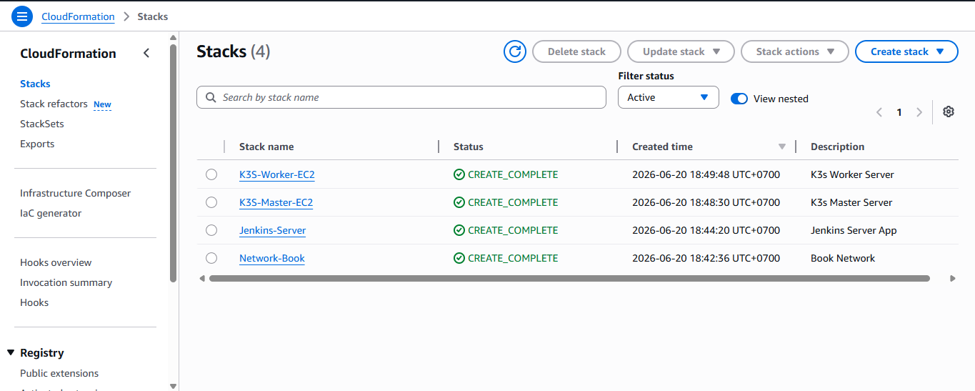

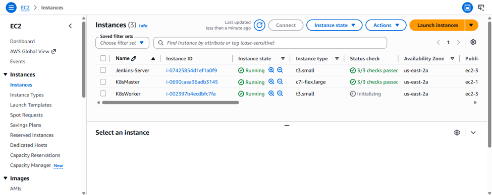

Successful create Infrastructure as code Cloudformation.

---

## Jenkins Pipeline Success

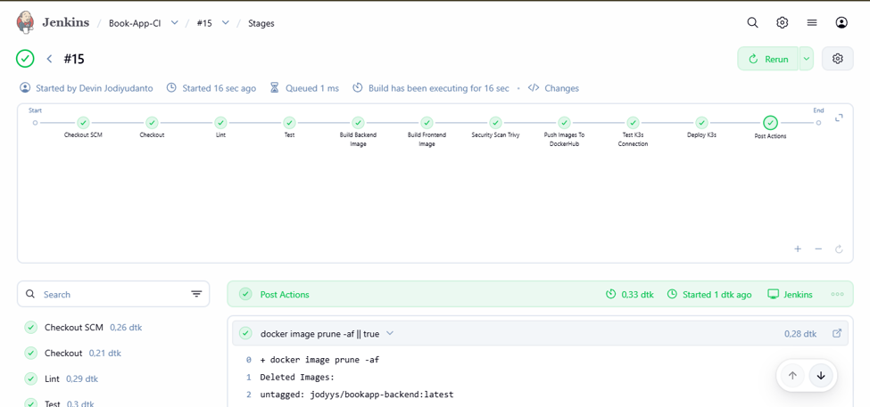

Successful CI pipeline execution.

---

## Docker Hub Images

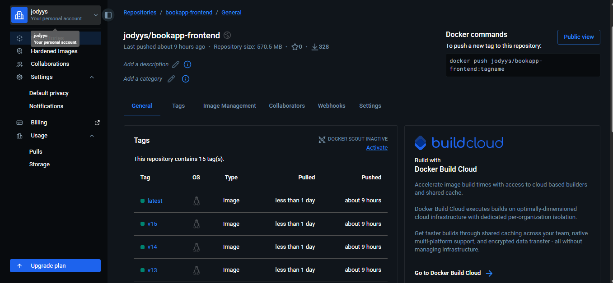

Frontend images pushed successfully.

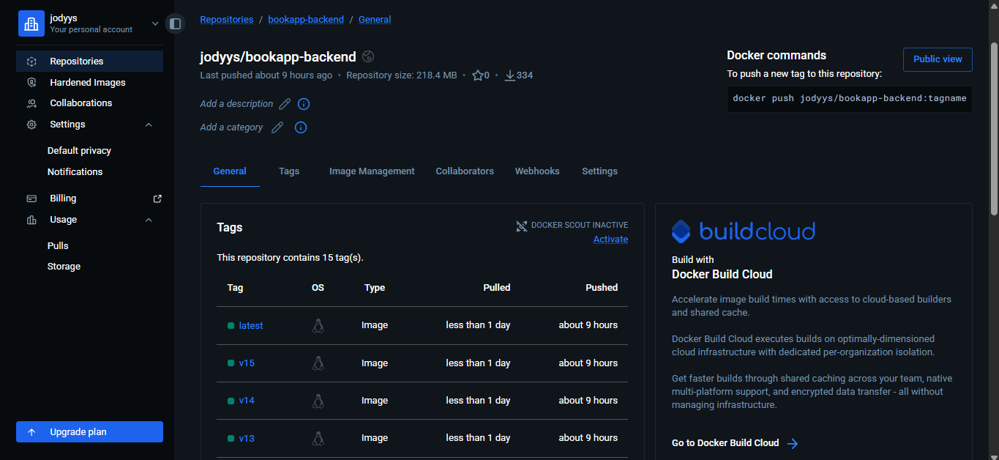

backend images pushed successfully.

---

## Applikasi Running On K3S

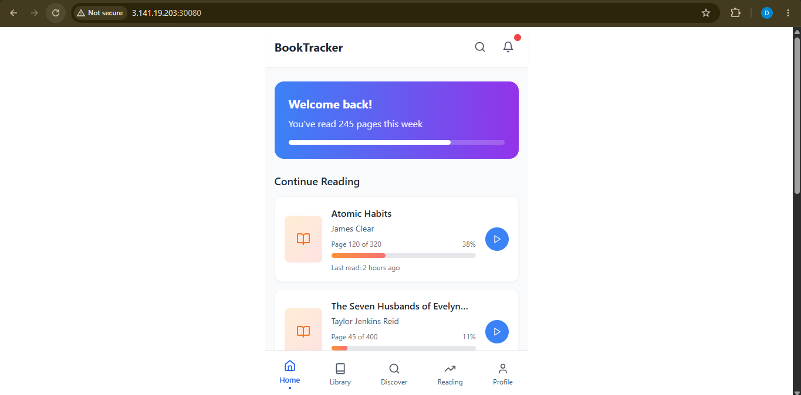

App Book Running on K3S.

---

## Kubernetes Nodes

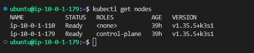

K3s cluster with master and worker nodes.

---

## Kubernetes Pods

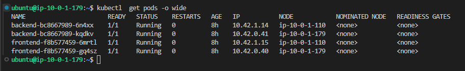

Application and monitoring workloads running successfully.

---

## Kubernetes SVC

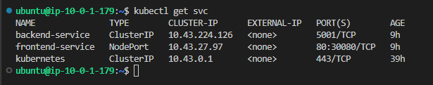

List Kubernetes Service.

---

## Prometheus Targets

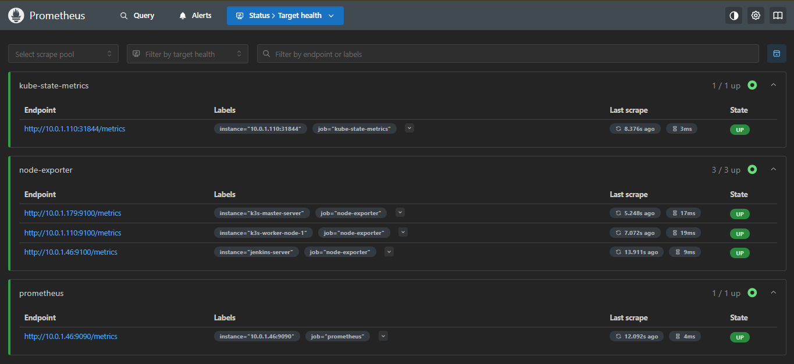

All monitoring targets are healthy and reachable.

---

## Grafana Node Exporter Dashboard

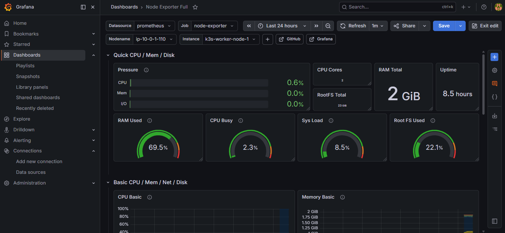

Infrastructure monitoring across all servers.

---

## Grafana Kubernetes Dashboard

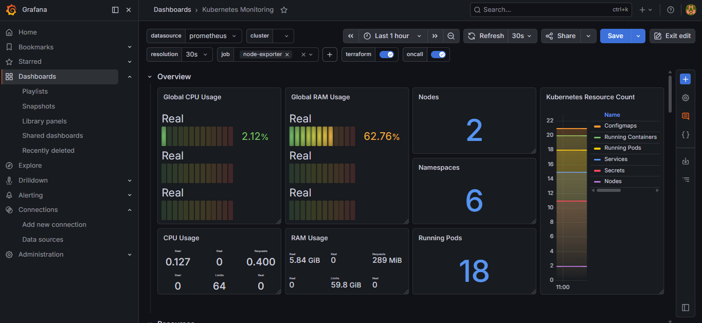

Cluster-level monitoring using kube-state-metrics.

---

# Project Structure

```text
book-app/
│
├── frontend/
├── backend/
│
├── k8s/
│   ├── frontend-deployment.yaml
│   ├── frontend-service.yaml
│   ├── backend-deployment.yaml
│   ├── backend-service.yaml
│   └── configmap.yaml
│
├── monitoring/
│   ├── prometheus.yml
│   └── docker-compose.yml
│
├── Jenkinsfile
├── Dockerfile.frontend
├── Dockerfile.backend
├── docker-compose.yml
└── README.md
```

---

# Results

Successfully implemented:

* Dockerized frontend and backend applications
* Jenkins CI pipeline
* Docker Hub image repository integration
* Kubernetes deployment using K3s
* Infrastructure monitoring with Prometheus and Grafana
* Kubernetes monitoring using kube-state-metrics
* Multi-node cluster monitoring using Node Exporter

This project demonstrates practical experience with modern DevOps practices including CI/CD, containerization, orchestration, observability, and cloud infrastructure management.
