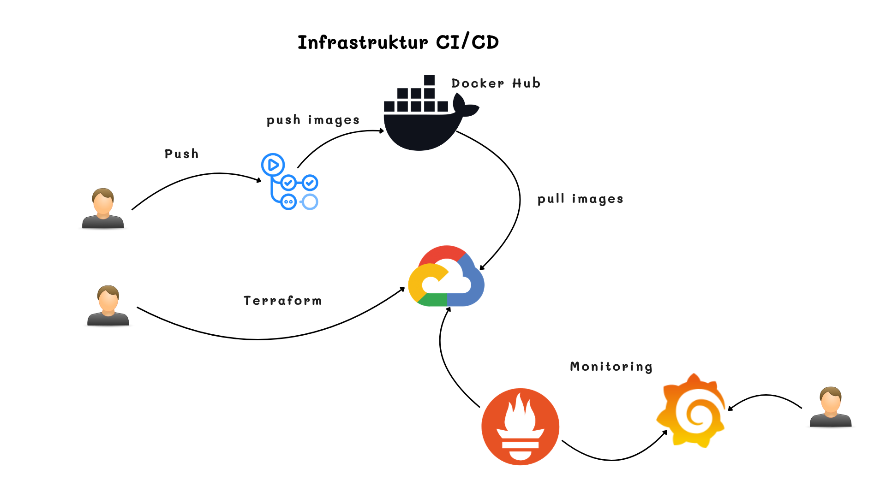
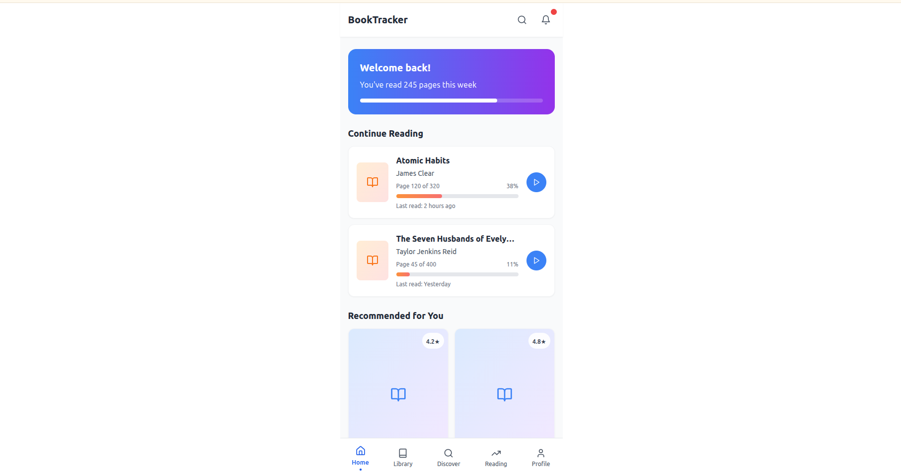
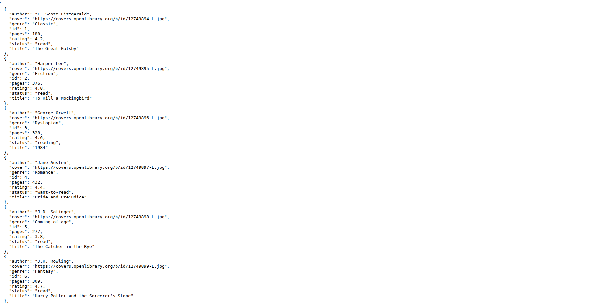
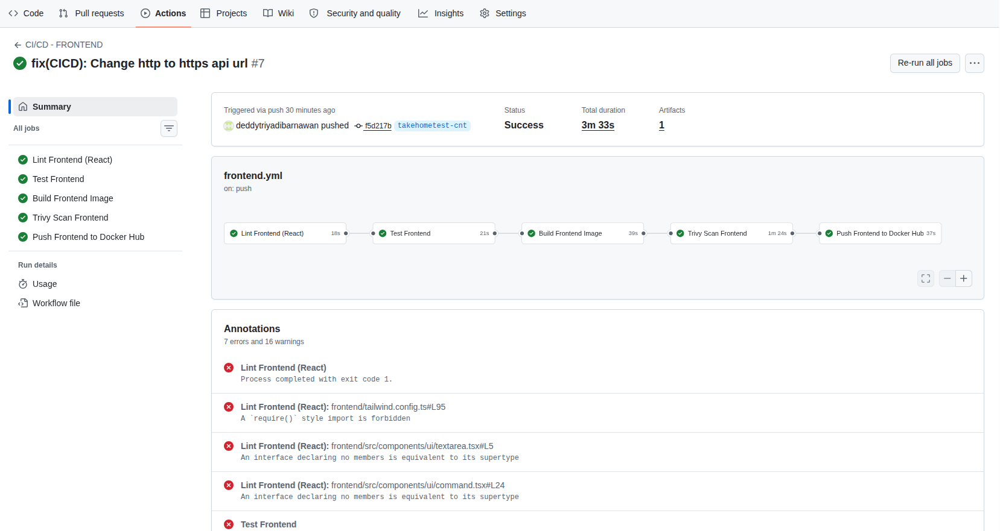
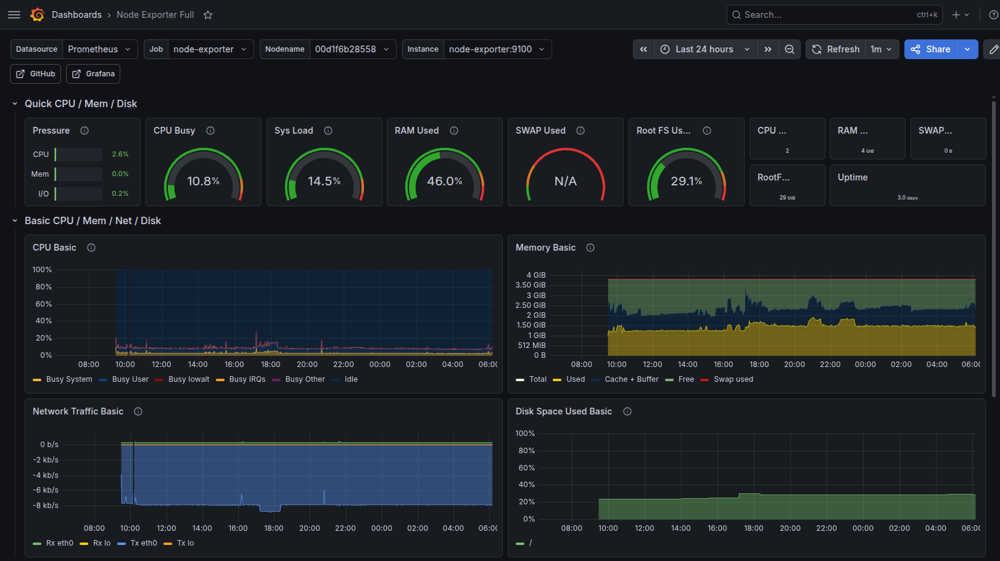

## DevOps Engineer - Dedi Triyadi Barnawan

### Langkah-langkah Deployment

#### 1. Clone Repository

Clone repository ke lokal atau server yang akan digunakan.

#### 2. Provisioning Infrastructure dengan Terraform

```bash
cd IaC-gcp
cp terraform.tfvars.example terraform.tfvars
vim terraform.tfvars
# Sesuaikan variabel dengan konfigurasi GCP Anda (project ID, region, zone, dll.)

terraform init
terraform plan
terraform apply
```

> Output Terraform akan menampilkan **IP publik server** yang akan digunakan pada langkah berikutnya.

#### 3. Deploy Application Stack ke Server

```bash
cd app-stack
vim .env.be
# Sesuaikan environment variable backend (database URL, secret key, dll.)
# Untuk environment variable frontend, sesuaikan pada file workflow GitHub Actions

docker compose up -d
```

#### 4. Deploy Monitoring Stack

```bash
cd monitoring-stack
vim prometheus/prometheus.yml
# Sesuaikan target URL/IP aplikasi pada konfigurasi scrape

docker compose up -d
```

#### Akses Layanan

| Layanan | URL / Address |
|---|---|
| Aplikasi | `http://app.domain.com` |
| Grafana (Monitoring) | `http://<ip-server>:3000` — login: `admin / bismillah` |

---

## Frontend



---

## Backend



---

## CI/CD — GitHub Actions



---

## Monitoring

