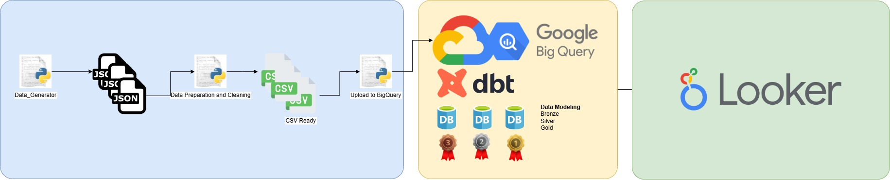
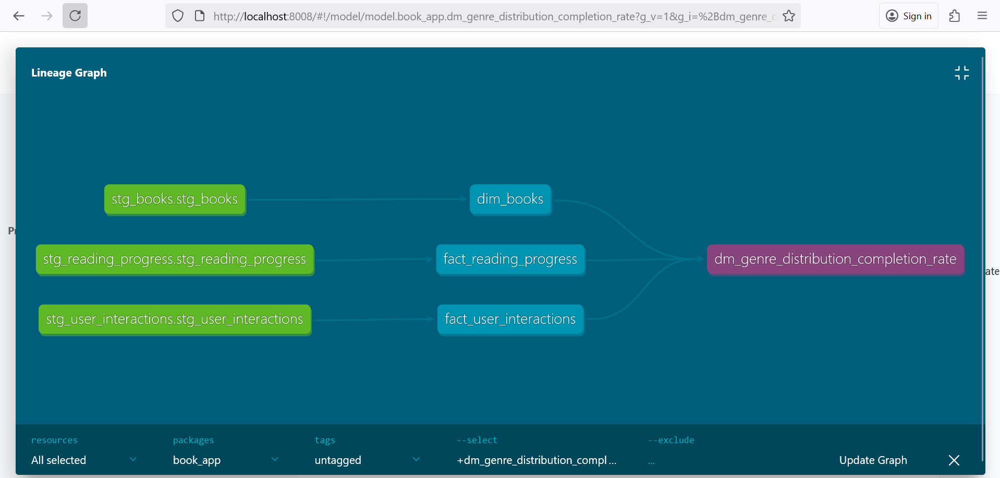
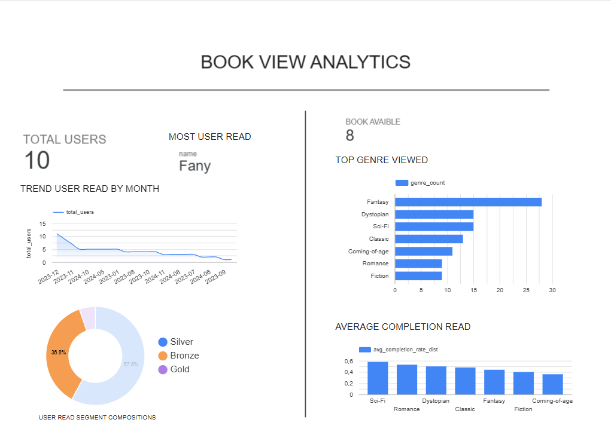

# Book App Analytics

Technical test DE dari generate source data hingga Visualisasi 

## Archicture Proyek

Penjelasan:
1. Python Generator mengenerate secara random untuk masing masing table :
    * reading progress
    * user interactions

2. Semua hasil akan di save ke .json 
3. JSON File akan diconvert dan disesuaikan format ke CSV 
4. CSV akan di uploa ke BigQuery untuk dilakukan data modelling 
5. Datamodeling terdiri dari : 
    * staging : tempat store temporary file excel 
    * warehouses : tempat untuk membentuk dimensional and fact table
    * datamart : tempat untuk mengambil data yang sudah berbentuk aggregasi dan siap untuk ditampilkan/visualisasi
     
    Untuk Dokumentasi dari DBT bisa digenerate dengan 
    `dbt docs serve --port 8008`
     

    
    
    
6. Visualisi menggunakan Google Looker Studio

    