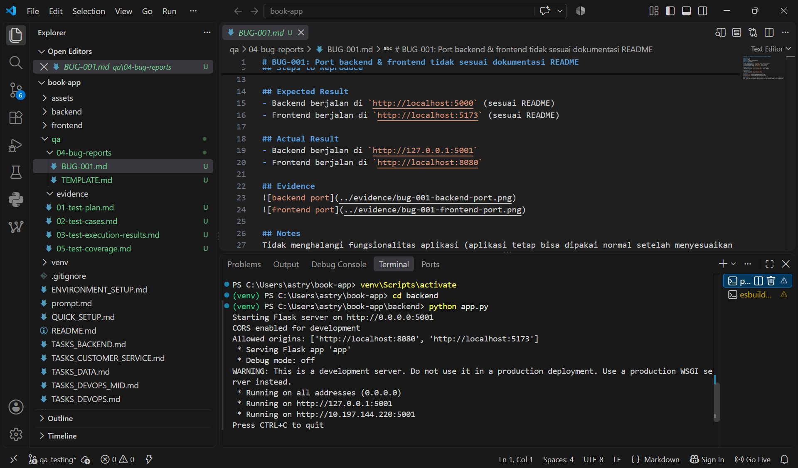
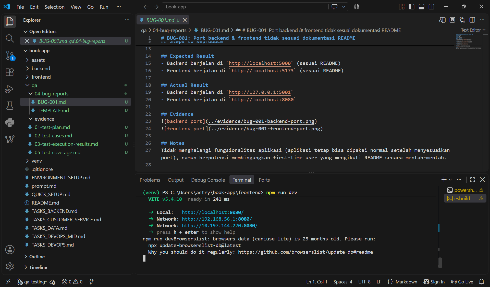

# BUG-001: Port backend & frontend tidak sesuai dokumentasi README

**Severity:** Low
**Priority:** Low
**Status:** Open
**Found by:** Astry Debora Sipayung
**Date:** 09 September 2026

## Prosedur yang Dilakukan
1. Ikuti instruksi setup di `README.md` bagian "Getting Started"
2. Jalankan backend dengan `python app.py` sesuai instruksi
3. Jalankan frontend dengan `npm run dev` sesuai instruksi

## Expected Result
- Backend berjalan di `http://localhost:5000` (sesuai README)
- Frontend berjalan di `http://localhost:5173` (sesuai README)

## Actual Result
- Backend berjalan di `http://127.0.0.1:5001`
- Frontend berjalan di `http://localhost:8080`

## Evidence

## Notes
Aplikasi tetap bisa dipakai normal setelah menyesuaikan port, namun berpotensi membingungkan first-time user yang mengikuti README secara mentah-mentah.
