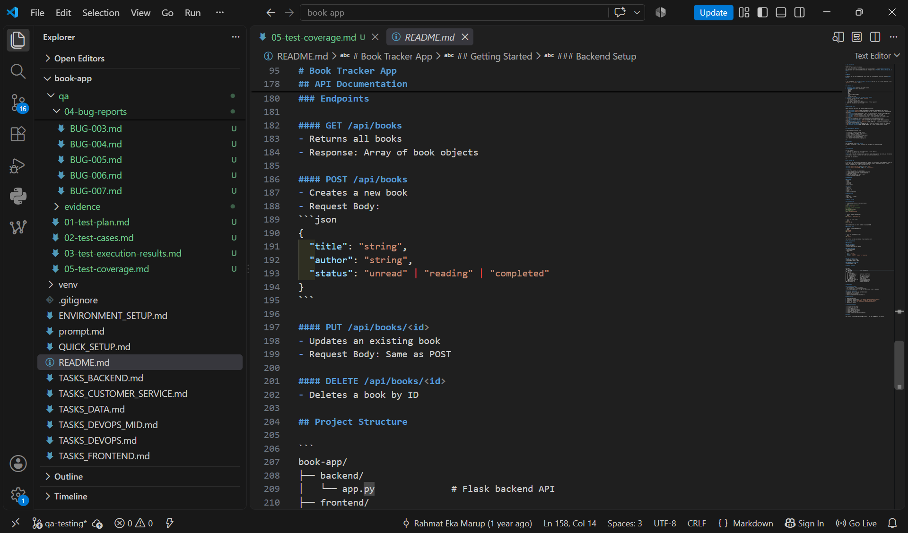
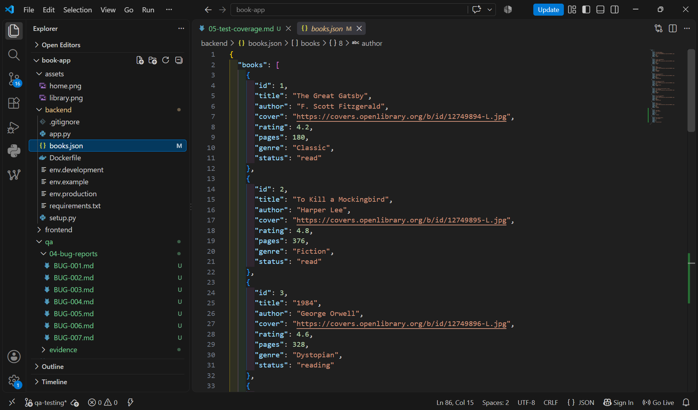

# BUG-005: Nilai status di data API tidak sesuai dengan yang tertulis di README

**Severity:** Medium
**Priority:** Medium
**Status:** Open
**Found by:** Astry Debora Sipayung
**Date:** 09 September 2026

## Prosedur yang Dilakukan
1. Akses endpoint GET http://127.0.0.1:5001/api/books
2. Perhatikan nilai field `status` pada tiap buku
3. Bandingkan dengan dokumentasi field `status` di README.md (bagian POST /api/books)

## Expected Result
Nilai `status` pada data seharusnya sesuai dengan yang didokumentasikan di README, yaitu salah satu dari: `unread`, `reading`, `completed`.

## Actual Result
Nilai `status` yang muncul pada data aktual adalah: `read`, `reading`, `want-to-read`. Dua nilai (`read` dan `want-to-read`) tidak sesuai dengan dokumentasi (`completed` dan `unread`).

## Evidence

## Notes
Ketidaksesuaian ini bisa menyebabkan masalah jika ada pihak lain yang mengikuti README sebagai acuan saat mengirim data status lewat POST atau PUT, karena nilai yang mereka kirim tidak akan cocok dengan nilai yang sudah dipakai di data yang ada.