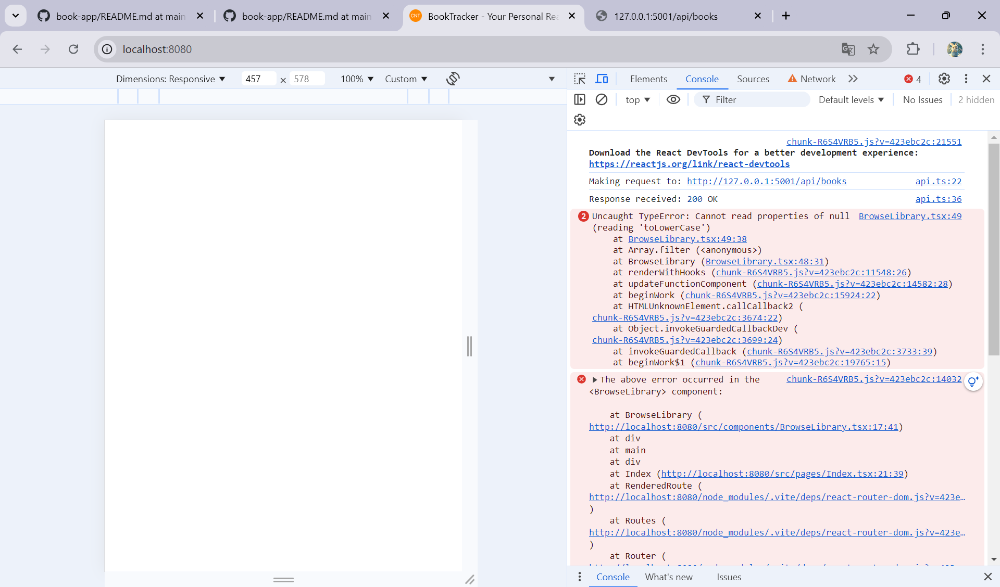

# BUG-006: POST /api/books tanpa title tetap diterima, menyebabkan halaman Browse Library crash

**Severity:** High
**Priority:** High
**Status:** Open
**Found by:** Astry Debora Sipayung
**Date:** 09 September 2026

## Prosedur yang Dilakukan
1. Kirim request POST ke http://127.0.0.1:5001/api/books
2. Kirim body tanpa field "title", hanya author dan status:
   {"author":"Test Author","status":"reading"}
3. Buka/refresh halaman Browse Library di frontend

## Expected Result
Request seharusnya ditolak dengan response error 400, karena title adalah field wajib. Halaman Browse Library seharusnya tetap berfungsi normal apapun datanya.

## Actual Result
Request tetap diterima dengan status 201 Created, buku baru terbuat dengan title bernilai null (id 10). Setelah data ini masuk, halaman Browse Library menjadi blank total. Console browser menunjukkan error:

Uncaught TypeError: Cannot read properties of null (reading 'toLowerCase')
di BrowseLibrary.tsx:49, dipicu dari proses filter data (Array.filter) di baris 48.

## Evidence

## Notes
Masalah ini disebabkan oleh dua hal. Pertama, sistem tidak memeriksa apakah judul buku sudah diisi sebelum menyimpan data. Kedua, tampilan halaman juga tidak siap menerima data dengan judul kosong, sehingga menyebabkan seluruh halaman gagal ditampilkan. Karena dampaknya membuat seluruh halaman Browse Library tidak dapat digunakan, tingkat keparahan (severity) ditetapkan sebagai High.