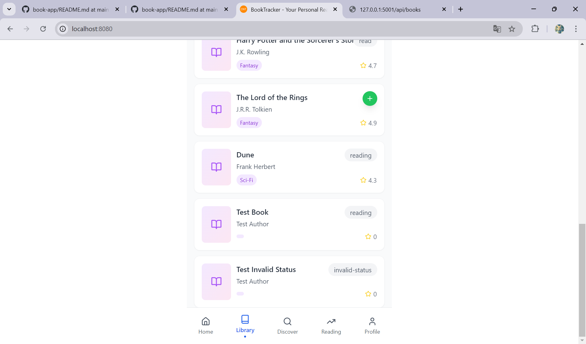

# BUG-007: POST /api/books menerima nilai status yang tidak sesuai daftar yang ditentukan

**Severity:** Low
**Priority:** Low
**Status:** Open
**Found by:** Astry Debora Sipayung
**Date:** 09 September 2026

## Prosedur yang Dilakukan
1. Kirim request POST ke http://127.0.0.1:5001/api/books
2. Kirim body dengan nilai status yang tidak ada dalam daftar yang seharusnya (misalnya "reading", "unread", "completed"):
   {"title":"Test Book","author":"Test Author","status":"invalid-status"}
3. Buka/refresh halaman Browse Library di frontend, cek buku yang baru dibuat

## Expected Result
Request seharusnya ditolak dengan response error 400, karena nilai status yang dikirim tidak termasuk dalam pilihan yang sudah ditentukan.

## Actual Result
Request tetap diterima dengan status 201 Created, dan buku baru tersimpan dengan status "invalid-status". Di halaman Browse Library, badge status pada buku tersebut menampilkan tulisan "invalid-status" apa adanya. Halaman tetap berjalan normal, tidak ada error atau crash.

## Evidence

## Notes
Sistem tidak memeriksa apakah nilai status yang dikirim sudah sesuai dengan pilihan yang ditentukan sebelum data disimpan. Berbeda dari kasus judul kosong pada BUG-006, masalah ini tidak membuat halaman berhenti berfungsi hanya menampilkan status yang seharusnya tidak ada. 